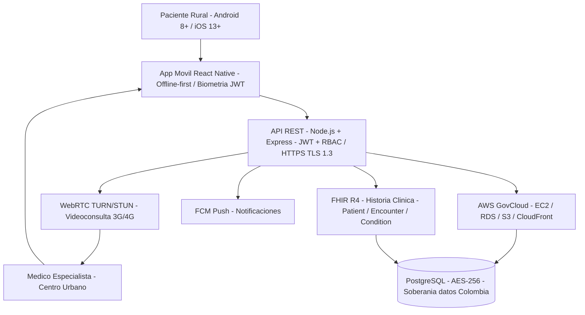

<div align="center">

# 🏥 TeleSalud Rural Colombia — Mobile Telemedicine Platform

> **Proyecto académico** · Maestría en Arquitectura de Software · Politécnico Grancolombiano  
> Asignatura: Gerencia de Proyectos · Grupo J04\_7 · 2026

</div>

---

---

## 📋 Tabla de Contenido

- [Descripción General](#descripción-general)
- [Problema que Resuelve](#problema-que-resuelve)
- [Arquitectura de la Solución](#arquitectura-de-la-solución)
- [Stack Tecnológico](#stack-tecnológico)
- [Módulos del Sistema](#módulos-del-sistema)
- [Estructura del Proyecto (WBS)](#estructura-del-proyecto-wbs)
- [Ciclo de Vida e Hitos](#ciclo-de-vida-e-hitos)
- [Gestión del Proyecto](#gestión-del-proyecto)
- [Métricas de Calidad y Aceptación](#métricas-de-calidad-y-aceptación)
- [Seguridad y Cumplimiento Normativo](#seguridad-y-cumplimiento-normativo)
- [Entregables](#entregables)
- [Equipo](#equipo)
- [Stakeholders Clave](#stakeholders-clave)
- [Presupuesto](#presupuesto)
- [Estado Actual del Proyecto](#estado-actual-del-proyecto)
- [Bibliografía y Marcos de Referencia](#bibliografía-y-marcos-de-referencia)

---

## Descripción General

**TeleSalud Rural Colombia** es una aplicación móvil multiplataforma (Android e iOS) diseñada para prestar servicios de telemedicina en municipios rurales y zonas de difícil acceso geográfico de Colombia. La plataforma conecta pacientes rurales con médicos generales y especialistas en centros urbanos, con soporte crítico para operación en condiciones de **baja o nula conectividad**.

| Atributo | Valor |
|---|---|
| Código del Proyecto | `PRJ-TSRC-2026-001` |
| Organización | HealthConnect S.A.S. — Innovación en Salud Digital |
| Gerente del Proyecto | Ing. Alejandro De Mendoza, PMP® |
| Fecha de Inicio | 05 mayo 2026 |
| Fecha de Go-Live | 31 octubre 2026 (26 semanas) |
| Presupuesto Aprobado | COP $233.054.000 (techo: $320.000.000) |
| Versión Documento | v1.0 — Línea Base |

---

## Problema que Resuelve

El **35% de la población rural colombiana** (~5.2 millones de personas) carece de acceso oportuno a atención médica primaria (MinSalud, 2024). Los indicadores son críticos:

- Mortalidad materna en zonas rurales: **87/100.000 NV** vs. 32/100.000 NV en zonas urbanas
- Enfermedades prevenibles detectadas tardíamente por ausencia de médicos en municipios alejados
- Costos de desplazamiento insostenibles para familias de bajos recursos

La telemedicina, habilitada por la **Resolución 2654 de 2019** del MinSalud, es la solución técnica y regulatoriamente viable para cerrar estas brechas.

**Impacto esperado en el primer año:**

- 🏘️ 120.000 pacientes beneficiados en 15 municipios rurales (Nariño, Chocó, Vichada)
- 🚗 Reducción del 60% en desplazamientos de pacientes
- 📊 Break-even en el mes 10 post-lanzamiento · ROI proyectado: 120%

---

## Arquitectura



## Stack Tecnológico

| Capa | Tecnología | Justificación |
|---|---|---|
| **Mobile** | React Native (Android + iOS) | Codebase unificado, soporte offline nativo, amplio ecosistema |
| **Backend** | Node.js + Express | Performance para I/O intensivo, fácil integración REST + WebRTC |
| **Base de datos** | PostgreSQL (cifrada AES-256) | ACID compliance para datos clínicos críticos |
| **Videollamadas** | Agora SDK (fallback WebRTC TURN/STUN) | Mejor rendimiento en redes 3G rurales que WebRTC puro |
| **Interoperabilidad** | HL7 FHIR R4 | Estándar internacional para historia clínica digital |
| **Infraestructura** | AWS GovCloud (EC2 t3.large × 2, RDS, S3, CloudFront) | Cumplimiento normativo de soberanía de datos |
| **Auth** | JWT + biometría + Cédula Digital | Seguridad multicapa conforme a Resolución 2654/2019 |
| **Push** | Firebase Cloud Messaging (FCM) | Notificaciones de citas y alertas de pacientes crónicos |
| **CI/CD** | GitHub Actions | Pipeline automatizado para deploy en AWS |
| **Gestión** | Jira + Confluence | Trazabilidad de issues, documentación y control de cambios |
| **Diseño** | Figma | Prototipos de alta fidelidad validados con usuarios rurales |
| **QA** | Apache JMeter (carga) + OWASP Mobile Top 10 (seguridad) | Validación de rendimiento y seguridad previo al piloto |

---

## Módulos del Sistema

### M1 · Telemedicina Sincrónica
Videoconsulta médica con sala de espera virtual, compartición de documentos clínicos en tiempo real, grabación cifrada en S3 (con consentimiento del paciente) y modo de baja conectividad con degradación elegante a consulta asincrónica.

**KPIs de aceptación:** Latencia de video < 500ms en 3G · Disponibilidad ≥ 99% · 0 errores críticos

### M2 · Historia Clínica Digital (FHIR R4)
Registro, consulta y actualización de historia clínica digital compatible con HL7 FHIR R4. Incluye gestión de prescripciones con **firma digital del médico** válida para dispensación en farmacias habilitadas, y remisiones digitales.

**KPIs de aceptación:** Validación FHIR R4 por médico informático · 0 vulnerabilidades críticas

### M3 · Seguimiento de Pacientes Crónicos
Monitoreo de condiciones crónicas (hipertensión, diabetes tipo 2) con alertas automáticas al médico tratante cuando los valores superan umbrales clínicos configurados.

**KPIs de aceptación:** 100% de alertas generadas ante umbrales superados · Validación clínica certificada

### M4 · Agendamiento de Citas
Sistema de agendamiento con notificaciones push via FCM. Soporta operación offline con sincronización automática.

### M5 · Autenticación y Seguridad
JWT + biometría (huella dactilar) + verificación de identidad via Cédula Digital. RBAC para segregación de roles (paciente / médico / administrador).

### M6 · Panel de Administración Médico
Dashboard para gestión de agenda, visualización de pacientes y seguimiento de indicadores clínicos del piloto.

---

## Estructura del Proyecto (WBS)

```
TeleSalud Rural Colombia (PRJ-TSRC-2026-001)
│
├── 1.0 Gestión del Proyecto
│   ├── 1.1 Inicio del Proyecto (kick-off, conformación equipo)
│   ├── 1.2 Planificación (Plan de Gestión Caps. 1–6)
│   ├── 1.3 Monitoreo y Control (EVM, CCC, riesgos)
│   ├── 1.4 Gestión Regulatoria (trámite habilitación MinSalud)
│   ├── 1.5 Gestión de Contratos (EPS, alcaldías, contratistas)
│   └── 1.6 Cierre del Proyecto
│
├── 2.0 Planificación y Diseño
│   ├── 2.1 Diseño Arquitectura (microservicios, FHIR R4, UML)
│   ├── 2.2 Diseño de Seguridad (AES-256, TLS 1.3, RBAC)
│   ├── 2.3 Diseño UX/UI (investigación usuario rural + Figma)
│   └── 2.4 Validación del Diseño (usabilidad con 15 usuarios)
│
├── 3.0 Desarrollo
│   ├── 3.1 Preparación del Entorno (AWS GovCloud, CI/CD)
│   ├── 3.2 Módulo Telemedicina (Agora SDK, sala de espera, 3G)
│   ├── 3.3 Historia Clínica Digital (FHIR R4, prescripción, crónicos)
│   ├── 3.4 Gestión de Citas (agendamiento + FCM)
│   ├── 3.5 Funcionalidad Offline (sincronización diferida)
│   └── 3.6 Seguridad y Acceso (JWT, biometría, Cédula Digital)
│
├── 4.0 Integración y Pruebas
│   ├── 4.1 Pruebas Funcionales (todos los flujos)
│   ├── 4.2 Pruebas de Rendimiento (JMeter, 300 usuarios concurrentes)
│   ├── 4.3 Pruebas en Campo (red 3G simulada + sin red)
│   ├── 4.4 Auditoría de Seguridad (OWASP Mobile Top 10, pentesting)
│   └── 4.5 Corrección de Defectos
│
├── 5.0 Piloto (Tumaco, Nariño · Mitú, Vaupés)
│   ├── 5.1 Preparación (capacitación pacientes y médicos)
│   ├── 5.2 Ejecución (200 pacientes · 10 médicos · 6 semanas)
│   ├── 5.3 Recolección de Información (NPS, satisfacción, clínico)
│   └── 5.4 Evaluación y Ajustes (mejoras pre go-live)
│
└── 6.0 Despliegue y Cierre
    ├── 6.1 Despliegue en Producción (AWS GovCloud, 15 municipios)
    ├── 6.2 Habilitación Operativa (MinSalud · REPS)
    ├── 6.3 Documentación Final (E-08)
    └── 6.4 Cierre Formal (acta de cierre · lecciones aprendidas)
```

---

## Ciclo de Vida e Hitos

El proyecto adopta un **ciclo de vida híbrido**: gobernanza predictiva PMI para gestión de fases, hitos y control de cambios, con metodología Scrum (sprints de 2 semanas) para el desarrollo iterativo del software.

| Hito | Descripción | Semana | Entregable |
|---|---|---|---|
| H-00 | Kick-off oficial del proyecto | S01 | Acta de Constitución firmada |
| H-01 | Arquitectura técnica aprobada por CTO | S02 | E-01: Documento de Arquitectura |
| H-02 | Prototipo UI/UX validado con usuarios rurales | S05 | E-02: Prototipo Alta Fidelidad |
| H-03 | Módulo de telemedicina sincrónica operativo | S08 | E-03: Módulo Telemedicina |
| H-04 | Historia clínica FHIR R4 implementada y validada | S11 | E-04: Historia Clínica Digital |
| H-05 | Versión beta completa (todos los módulos integrados) | S14 | E-05: App Móvil Beta |
| H-06 | Auditoría de seguridad superada (0 vulnerabilidades críticas) | S16 | Informe Auditoría de Seguridad |
| H-07 | Piloto completado en Tumaco y Mitú | S23 | E-06: Informe Resultados del Piloto |
| H-08 | App v1.0 desplegada en producción — Go-Live 15 municipios | S25 | E-07: Aplicación en Producción v1.0 |
| H-09 | Cierre formal del proyecto | S26 | E-08: Documentación Técnica + Acta de Cierre |

**Ruta Crítica:** `Diseño Arquitectura → Desarrollo Backend FHIR → Integración + QA → Auditoría de Seguridad → Trámite MinSalud → Go-Live`

> ⚠️ El trámite de habilitación ante el MinSalud **no es compresible por fast-tracking**. Se inicia en S01 en paralelo y es monitoreado semanalmente por el GM y la Asesora Legal.

---

## Gestión del Proyecto

### Metodología
Enfoque **híbrido PMI + Scrum**:
- PMI para planificación, control de cambios, gestión de riesgos y trazabilidad documental regulatoria
- Scrum para construcción iterativa con sprints de 2 semanas (Fases F2 y F3)

### Control de Cambios (CCC)

Todo cambio sobre las líneas base requiere seguir el **Proceso de Control Integrado de Cambios**:

| Nivel | Autoridad | Umbral Costo | Umbral Tiempo |
|---|---|---|---|
| Nivel 1 (Verde) | Gerente del Proyecto | ≤ 5% fase en curso (máx. $9M COP) | ≤ ±3% duración total (≤ 4 días hábiles) |
| Nivel 2 (Amarillo) | Comité CCC | 5%–15% presupuesto total | 3%–10% duración total |
| Nivel 3 (Rojo) | Sponsor + CCC | > 15% o supera techo $320M | > 10% o impacta H-08 / trámite MinSalud |

> Todo cambio con impacto regulatorio (funcionalidades declaradas ante MinSalud) escala **siempre a Nivel 3**, independientemente del impacto económico.

### Gestión de Riesgos

| ID | Riesgo | Exposición | Estrategia |
|---|---|---|---|
| RG-01 | Retrasos en habilitación MinSalud | **CRÍTICO** | Iniciar trámite en S03 · Asesor jurídico especialista desde el inicio |
| RG-02 | Conectividad insuficiente en municipios piloto | **CRÍTICO** | Prueba de campo en S04 · Plan B: consultas asincrónicas como fallback |
| RG-03 | Baja adopción por baja alfabetización digital | **ALTO** | Capacitación presencial · Interfaz ultrasimplificada · Agentes comunitarios |
| RG-04 | Rotación del médico consultor o experto en seguridad | **ALTO** | Cláusulas de exclusividad · Documentación continua · Suplentes identificados |
| RG-05 | Vulnerabilidad en datos clínicos | **ALTO** | Pentesting S16 · AES-256 + TLS 1.3 desde el diseño · RBAC |

### Seguimiento — Indicadores EVM

| Métrica | Meta | Frecuencia |
|---|---|---|
| SPI (Schedule Performance Index) | ≥ 0.95 | Quincenal |
| CPI (Cost Performance Index) | ≥ 0.95 | Mensual |
| SV (Schedule Variance) | ≥ -5% | Quincenal |
| % completitud WBS | ≥ planificado por semana | Semanal |
| Tasa de retrabajo de entregables | ≤ 20% rechazados en 1.ª revisión | Por entregable |

---

## Métricas de Calidad y Aceptación

| Dimensión | Métrica | Meta |
|---|---|---|
| Satisfacción usuarios (piloto) | NPS | ≥ 45 |
| Satisfacción médicos | Escala Likert 1–5 | ≥ 4.2 / 5.0 |
| Satisfacción pacientes | Escala Likert 1–5 | ≥ 4.0 / 5.0 |
| Seguridad de datos | Incidentes críticos | 0 |
| Disponibilidad producción | Uptime primeros 30 días | ≥ 99.5% |
| Rendimiento 3G | Carga de app en red 3G | ≤ 5 segundos |
| Rendimiento 4G/WiFi | Carga de app | ≤ 2 segundos |
| Concurrencia | Sesiones simultáneas sin degradación | 300 |
| Usabilidad | Completitud de tareas (usuarios rurales) | ≥ 85% |
| Impacto clínico — diagnóstico oportuno | % consultas con diagnóstico oportuno | ≥ 70% |
| Impacto clínico — adherencia | % pacientes crónicos con adherencia al tratamiento | ≥ 60% |

---

## Seguridad y Cumplimiento Normativo

### Marco Legal
- **Resolución 2654 de 2019** (MinSalud): regula telemedicina. La plataforma debe habilitarse ante el MinSalud y registrarse en el REPS antes del go-live.
- **Ley 1581 de 2012** (Habeas Data): protección de datos personales y clínicos.
- **CONPES 3975 de 2019**: Política Nacional para la Transformación Digital.

### Controles de Seguridad Implementados

```
Cifrado en reposo:   AES-256 (PostgreSQL + S3)
Cifrado en tránsito: TLS 1.3
Control de acceso:   RBAC (roles: paciente / médico / admin)
Autenticación:       JWT + biometría + Cédula Digital
Auditoría:           Penetration testing OWASP Mobile Top 10 (S16)
Soberanía de datos:  AWS GovCloud · solo región Colombia
```

> Cualquier cambio a la arquitectura de seguridad o al tratamiento de datos de salud requiere revisión obligatoria del **Experto en Seguridad (Ing. Luis Mora)** antes de aprobación, independientemente del nivel de cambio.

---

## Entregables

| ID | Entregable | Fase | Criterio Clave de Aceptación |
|---|---|---|---|
| E-01 | Documento de Arquitectura y Diseño del Sistema | F1 | Aprobación CTO + validación cumplimiento Res. 2654/2019 |
| E-02 | Prototipo de Alta Fidelidad (UI/UX) | F1 | Validado con 15 usuarios · usabilidad ≥ 80% |
| E-03 | Módulo de Telemedicina Sincrónica | F2 | Latencia < 500ms en 3G · disponibilidad ≥ 99% · 0 errores críticos |
| E-04 | Módulo de Historia Clínica Digital | F2 | Cumplimiento FHIR R4 · aprobación auditoría de seguridad |
| E-05 | Aplicación Móvil Funcional (Beta) | F3 | 0 errores críticos · funcionalidad offline verificada en campo |
| E-06 | Informe de Resultados del Piloto | F4 | NPS ≥ 45 · satisfacción médicos ≥ 4.2 · 0 incidentes de seguridad |
| E-07 | Aplicación en Producción (v1.0) | F5 | Disponibilidad ≥ 99.5% en 30 días · aprobación MinSalud · UAT superado |
| E-08 | Documentación Técnica y Manual de Operación | F5 | Sin hallazgos críticos de auditoría · recepción técnica firmada |

---

## Equipo

| Rol | Nombre | Dedicación | Fases |
|---|---|---|---|
| **Gerente del Proyecto** | Ing. Alejandro De Mendoza, PMP® · CSM | 50% | Todas |
| **Dev Lead (Móvil Full-Stack)** | Ing. Santiago Pérez Vargas | 80% | F1, F2, F3 |
| **Dev Jr. (Frontend Móvil)** | Ing. Valentina Ríos Castro | 80% | F2, F3, F4 |
| **Médico Consultor** | Dr. Felipe Castaño Arango (contratista) | 60% | F1, F2, F4 |
| **Experto en Seguridad** | Ing. Luis Mora Quintero (contratista) | 80% | F1, F3 |
| **Diseñadora UX/UI** | Dis. Andrea Salcedo Pinto | 100% | F1 |
| **QA Tester** | Ing. Camilo Torres Herrera | 100% | F3, F4 |
| **Asesora Legal** | Dra. Patricia Useche (contratista) | Según demanda | F0–F1, F3, F5 |

> Política de equipos HealthConnect S.A.S.: máximo 7 personas en el equipo de proyecto (restricción RA-05).

---

## Stakeholders Clave

| ID | Actor | Tipo | Estrategia |
|---|---|---|---|
| ST-01 | Sponsors (Cubillos & Garzón) | Interno — Partidario | Gestionar de cerca · Informes ejecutivos quincenales |
| ST-09 | Pacientes Rurales (Tumaco, Mitú) | Externo — Neutral → **Apoyo** | Capacitación presencial · interfaz simplificada |
| ST-11 | EPS Aliadas (Asmet Salud, Coosalud) | Externo — Partidario | Convenios formales antes del piloto · informes mensuales |
| ST-12 | MinSalud | Externo — Neutral → **Apoyo** | Gestión proactiva del trámite de habilitación desde S01 |
| ST-16 | Competidores HealthTech | Externo — Reticente | Monitoreo de mercado · análisis mensual |

---

## Presupuesto

| Categoría | Costo Estimado (COP) | % |
|---|---|---|
| Recursos Humanos (total) | $170.000.000 | 58,2% |
| Infraestructura AWS GovCloud (8 meses) | $12.800.000 | 4,4% |
| Licencias (Figma, GitHub, Jira, Confluence, WebRTC) | $3.500.000 | 1,2% |
| Asesoría jurídica + trámite MinSalud | $8.000.000 | 2,7% |
| Logística del piloto (Tumaco + Mitú) | $12.000.000 | 4,1% |
| Auditoría de seguridad (pentesting + certificación) | $8.000.000 | 2,7% |
| **Reserva de Contingencia (10%)** | $18.754.000 | 6,4% |
| **TOTAL APROBADO** | **$233.054.000** | **100%** |

> El presupuesto aprobado ($233M) genera un margen de gestión de ~$87M respecto al techo autorizado ($320M), controlado por el Sponsor para cubrir cambios regulatorios o riesgos no identificados.

---

## Estado Actual del Proyecto

| Fase | Estado | Entregables Completados |
|---|---|---|
| F0 — Iniciación | ✅ Completada | Acta de Constitución · Registro de Stakeholders |
| F1 — Planificación y Diseño | ✅ Completada | Caps. 1–6 del Plan de Gestión del Proyecto |
| F2 — Desarrollo Core | 🔄 En curso | — |
| F3 — Integración y QA | ⏳ Pendiente | — |
| F4 — Piloto | ⏳ Pendiente | — |
| F5 — Despliegue y Cierre | ⏳ Pendiente | — |

---

## Bibliografía y Marcos de Referencia

- Project Management Institute. (2021). *PMBOK® Guide — 7th Edition*. PMI.
- Project Management Institute. (2017). *Agile Practice Guide*. PMI.
- Ministerio de Salud y Protección Social. (2019). *Resolución 2654 — Prestación de servicios de salud mediante tecnologías digitales*. MinSalud Colombia.
- Congreso de la República de Colombia. (2012). *Ley 1581 — Protección de datos personales*. Diario Oficial 48.587.
- Health Level Seven International. (2023). *HL7 FHIR R4*. [hl7.org/fhir](https://www.hl7.org/fhir/)
- OWASP Foundation. (2023). *OWASP Mobile Application Security Verification Standard (MASVS) v2.0*.
- Pressman, R. S., & Maxim, B. R. (2020). *Software Engineering: A Practitioner's Approach* (9th ed.). McGraw-Hill.

---

<div align="center">

**TeleSalud Rural Colombia** · Grupo J04\_7  
Juan Camilo Álvarez Cubillos · Orlando Garzón Ramos · Alejandro De Mendoza  
Politécnico Grancolombiano · Maestría en Arquitectura de Software · 2026

</div>

---

## Autor

**Alejandro De Mendoza**  
Ingeniero Informático · Especialista en IA · Especialista en Ingeniería de Software · Máster en Arquitectura de Software

[](https://github.com/AlejoTechEngineer)
